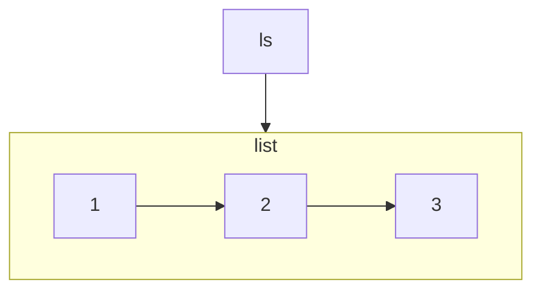
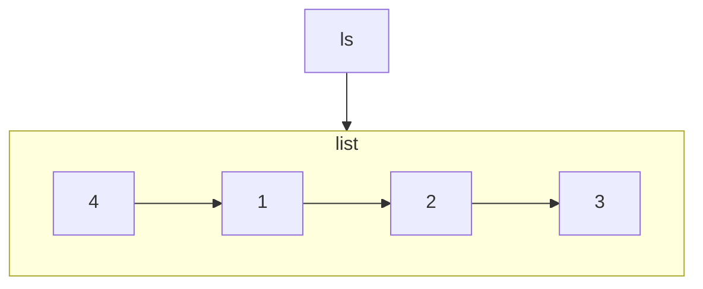
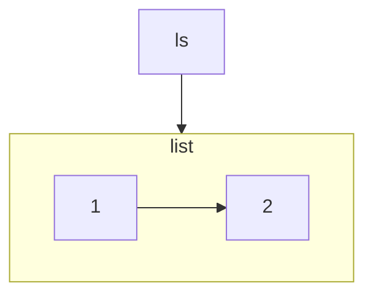

Redis 的列表，底层实现是一种链式结构，它可以高效地完成对于头部和尾部的操作，所以常常被作为队列使用。

列表使用的数据结构为快速列表 quicklist（在 3.2 版本之前为 ziplist 和 linkedlist），关于底层实现的具体细节将在后续章节中讲到。

对于 Redis 列表，可以使用 `LPUSH`、`LPOP`、`RPUSH`、`RPOP` 命令分别进行头插、头删、尾插、尾删操作。

使用 `LRANGE <key> <start> <stop>` 命令可以查看列表中指定范围的元素。其中 `start` 和 `stop` 支持负值，表示从后往前数多少个元素。

- 创建一个 key 为 ls 的列表。

~~~txt:no-line-numbers
127.0.0.1:6379> RPUSH ls 1 2 3
(integer) 3
127.0.0.1:6379> LRANGE ls 0 -1
1) "1"
2) "2"
3) "3"
~~~

- 在头部插入元素 4。

~~~text:no-line-numbers
127.0.0.1:6379> LPUSH ls 4
(integer) 4
127.0.0.1:6379> LRANGE ls 0 -1
1) "4"
2) "1"
3) "2"
4) "3"
~~~

- 头部删除和尾部删除。

~~~
127.0.0.1:6379> LPOP ls
"4"
127.0.0.1:6379> RPOP ls
"3"
127.0.0.1:6379> LRANGE ls 0 -1
1) "1"
2) "2"
~~~

以下是 Redis 列表相关的命令。

| 命令 | 描述 |
| :- | :- |
| [BLPOP](https://redis.com.cn/commands/blpop.html) | 移出并获取列表的第一个元素 |
| [BRPOP](https://redis.com.cn/commands/brpop.html) | 移出并获取列表的最后一个元素 |
| [BRPOPLPUSH](https://redis.com.cn/commands/brpoplpush.html) | 从列表中弹出一个值，并将该值插入到另外一个列表中并返回它 |
| [LINDEX](https://redis.com.cn/commands/lindex.html) | 通过索引获取列表中的元素 |
| [LINSERT](https://redis.com.cn/commands/linsert.html) | 在列表的元素前或者后插入元素 |
| [LLEN](https://redis.com.cn/commands/llen.html) | 获取列表长度 |
| [LPOP](https://redis.com.cn/commands/lpop.html) | 移出并获取列表的第一个元素 |
| [LPUSH](https://redis.com.cn/commands/lpush.html) | 将一个或多个值插入到列表头部 |
| [LPUSHX](https://redis.com.cn/commands/lpushx.html) | 将一个值插入到已存在的列表头部 |
| [LRANGE](https://redis.com.cn/commands/lrange.html) | 获取列表指定范围内的元素 |
| [LREM](https://redis.com.cn/commands/lrem.html) | 移除列表元素 |
| [LSET](https://redis.com.cn/commands/lset.html) | 通过索引设置列表元素的值 |
| [LTRIM](https://redis.com.cn/commands/ltrim.html) | 对一个列表进行修剪(trim) |
| [RPOP](https://redis.com.cn/commands/rpop.html) | 移除并获取列表最后一个元素 |
| [RPOPLPUSH](https://redis.com.cn/commands/rpoplpush.html) | 移除列表的最后一个元素，并将该元素添加到另一个列表并返回 |
| [RPUSH](https://redis.com.cn/commands/rpush.html) | 在列表中添加一个或多个值 |
| [RPUSHX](https://redis.com.cn/commands/rpushx.html) | 为已存在的列表添加值 |
