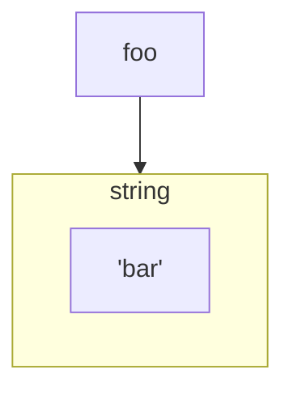

字符串是 `Redis` 最基本的数据类型，用 `SET` 和 `GET` 命令可以增加、修改和获取它的值。

~~~txt:no-line-numbers
127.0.0.1:6379> SET foo bar
OK
127.0.0.1:6379> GET foo
"bar"
~~~

以下是 Redis 字符串相关的命令。

| 命令 | 描述 |
| :- | :- |
| [SET](https://redis.com.cn/commands/set.html) | 设置指定 key 的值 |
| [GET](https://redis.com.cn/commands/get.html) | 获取指定 key 的值 |
| [GETRANGE](https://redis.com.cn/commands/getrange.html) | 返回 key 中字符串值的子字符 |
| [GETSET](https://redis.com.cn/commands/getset.html) | 将给定 key 的值设为 value ，并返回 key 的旧值 |
| [GETBIT](https://redis.com.cn/commands/getbit.html) | 对 key 所储存的字符串值，获取指定偏移量上的位 |
| [MGET](https://redis.com.cn/commands/mget.html) | 获取所有(一个或多个)给定 key 的值 |
| [SETBIT](https://redis.com.cn/commands/setbit.html) | 对 key 所储存的字符串值，设置或清除指定偏移量上的位 |
| [SETEX](https://redis.com.cn/commands/setex.html) | 设置 key 的值为 value 同时将过期时间设为 seconds |
| [SETNX](https://redis.com.cn/commands/setnx.html) | 只有在 key 不存在时设置 key 的值 |
| [SETRANGE](https://redis.com.cn/commands/setrange.html) | 从偏移量 offset 开始用 value 覆写给定 key 所储存的字符串值 |
| [STRLEN](https://redis.com.cn/commands/strlen.html) | 返回 key 所储存的字符串值的长度 |
| [MSET](https://redis.com.cn/commands/mset.html) | 同时设置一个或多个 key-value 对 |
| [MSETNX](https://redis.com.cn/commands/msetnx.html) | 同时设置一个或多个 key-value 对 |
| [PSETEX](https://redis.com.cn/commands/psetex.html) | 以毫秒为单位设置 key 的生存时间 |
| [INCR](https://redis.com.cn/commands/incr.html) | 将 key 中储存的数字值增一 |
| [INCRBY](https://redis.com.cn/commands/incrby.html) | 将 key 所储存的值加上给定的增量值 |
| [INCRBYFLOAT](https://redis.com.cn/commands/incrbyfloat.html) | 将 key 所储存的值加上给定的浮点增量值 |
| [DECR](https://redis.com.cn/commands/decr.html) | 将 key 中储存的数字值减一 |
| [DECRBY](https://redis.com.cn/commands/decrby.html) | 将 key 所储存的值减去给定的减量值 |
| [APPEND](https://redis.com.cn/commands/append.html) | 将 value 追加到 key 原来的值的末尾 |
