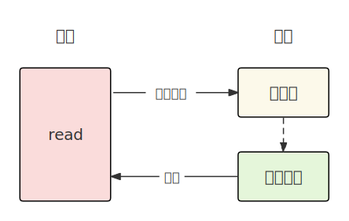
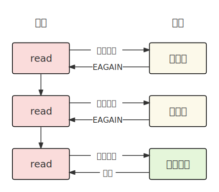
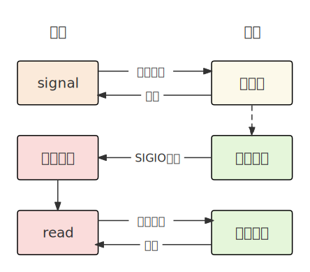
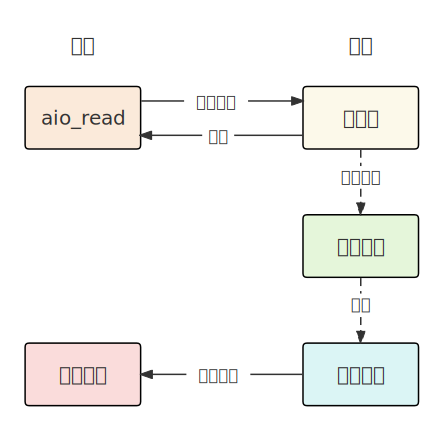
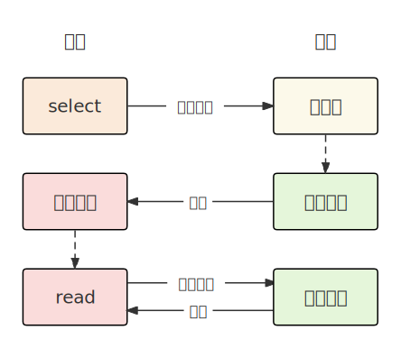

在Linux系统中，一切皆文件，所有与外设的交互，包括键盘、鼠标、显示器、磁盘、以及进程通信和网络通信，都可以抽象为文件的读写。

## 1. 阻塞式IO

最常见的IO模型，当进程调用IO接口，比如C语言的scanf时，如果用户没有输入，进程会一直阻塞等待。

进程阻塞挂起等待时不消耗CPU资源，资源就绪时能及时响应，实现比较简单。

## 2. 非阻塞式IO

进程以非阻塞的形式调用IO接口，如果内核缓冲区没有数据，则返回一个错误（EAGAIN，EWOULDBLOCK）而不被阻塞。

非阻塞IO需要用户以循环的方式反复调用读写接口，这个过程称为**轮询**。当轮询间隔过短时，对CPU资源浪费较大，轮询间隔过长时，资源拷贝不及时。一般只有特定场景才使用。

## 3. 信号驱动IO

当进程向内核注册一个信号处理函数。内核将数据准备好时，会发送IO信号（SIGIO）通知应用进程，进程在信号处理函数中调用IO接口读取数据。

信号驱动IO需要处理IO信号，设置回调函数，实现比较复杂。

## 4. 异步IO

IO的等待数据和拷贝过程异步完成，用户进程只需要读取。内核在数据拷贝完成时, 通知应用程序。

异步IO将等待数据和拷贝数据的过程交给内核去做，不需要应用进程关心这些过程。数据一步到位，应用进程只需要读取。需要操作系统支持，实现难度较大，适用于高性能高并发应用。

## 5. IO多路转接

通过同时等待多个文件描述符，提高等待数据的效率。

select系统调用可以同时监视多个文件描述符的状态变化，程序会在这里被阻塞，直到被监视的文件描述符有一个或多个发生了状态改变。
