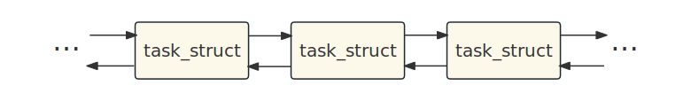
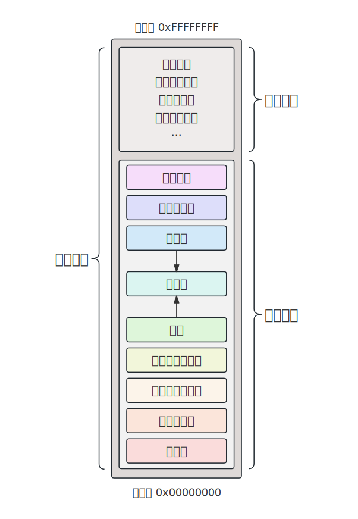

## 1. 什么是进程

进程是Linux操作系统的一个重要概念。简单来讲，当可执行程序在磁盘上时，它是一个二进制文件，而将程序运行起来后，就叫做进程。

进程的执行需要消耗CPU、内存等资源。可以把进程看作是操作系统分配的资源单元，每个进程都持有自己独立的内存空间，包括代码、数据和堆栈，同时还包含了所需的系统资源，如文件描述符、网络连接等。

::: info 查看进程的命令

在Linux中，可以使用 `ps aux` 命令，或任务管理器 `top` 命令，查看当前系统中存在的进程及相关信息。

:::

通过进程，操作系统能够同时运行多个程序，并为它们提供必要的资源支持。进程之间也可以进行交互和协作。操作系统通过进程控制来管理进程，确保它们按照预期的方式运行。

## 2. 进程控制块 PCB

进程控制块（Process Control Block，PCB）是操作系统中用于管理进程的数据结构。每个进程在操作系统中都有一个对应的PCB，它记录了进程的相关信息和状态。

::: info PCB的数据结构

Linux内核使用 `task_struct` 结构体描述进程。我们可以在源代码 `sched.h` 中找到以下的定义。

::: details task_struct

~~~c
struct task_struct {
#ifdef CONFIG_THREAD_INFO_IN_TASK
    /*
     * For reasons of header soup (see current_thread_info()), this
     * must be the first element of task_struct.
     */
    struct thread_info        thread_info;
#endif
    unsigned int            __state;

#ifdef CONFIG_PREEMPT_RT
    /* saved state for "spinlock sleepers" */
    unsigned int            saved_state;
#endif

    /*
     * This begins the randomizable portion of task_struct. Only
     * scheduling-critical items should be added above here.
     */
    randomized_struct_fields_start

    void                *stack;
    refcount_t            usage;
    /* Per task flags (PF_*), defined further below: */
    unsigned int            flags;
    unsigned int            ptrace;

#ifdef CONFIG_SMP
    int                on_cpu;
    struct __call_single_node    wake_entry;
    unsigned int            wakee_flips;
    unsigned long            wakee_flip_decay_ts;
    struct task_struct        *last_wakee;

    /*
     * recent_used_cpu is initially set as the last CPU used by a task
     * that wakes affine another task. Waker/wakee relationships can
     * push tasks around a CPU where each wakeup moves to the next one.
     * Tracking a recently used CPU allows a quick search for a recently
     * used CPU that may be idle.
     */
    int                recent_used_cpu;
    int                wake_cpu;
#endif
    int                on_rq;

    int                prio;
    int                static_prio;
    int                normal_prio;
    unsigned int            rt_priority;

    struct sched_entity        se;
    struct sched_rt_entity        rt;
    struct sched_dl_entity        dl;
    const struct sched_class    *sched_class;

#ifdef CONFIG_SCHED_CORE
    struct rb_node            core_node;
    unsigned long            core_cookie;
    unsigned int            core_occupation;
#endif

#ifdef CONFIG_CGROUP_SCHED
    struct task_group        *sched_task_group;
#endif

#ifdef CONFIG_UCLAMP_TASK
    /*
     * Clamp values requested for a scheduling entity.
     * Must be updated with task_rq_lock() held.
     */
    struct uclamp_se        uclamp_req[UCLAMP_CNT];
    /*
     * Effective clamp values used for a scheduling entity.
     * Must be updated with task_rq_lock() held.
     */
    struct uclamp_se        uclamp[UCLAMP_CNT];
#endif

    struct sched_statistics         stats;

#ifdef CONFIG_PREEMPT_NOTIFIERS
    /* List of struct preempt_notifier: */
    struct hlist_head        preempt_notifiers;
#endif

#ifdef CONFIG_BLK_DEV_IO_TRACE
    unsigned int            btrace_seq;
#endif

    unsigned int            policy;
    int                nr_cpus_allowed;
    const cpumask_t            *cpus_ptr;
    cpumask_t            *user_cpus_ptr;
    cpumask_t            cpus_mask;
    void                *migration_pending;
#ifdef CONFIG_SMP
    unsigned short            migration_disabled;
#endif
    unsigned short            migration_flags;

#ifdef CONFIG_PREEMPT_RCU
    int                rcu_read_lock_nesting;
    union rcu_special        rcu_read_unlock_special;
    struct list_head        rcu_node_entry;
    struct rcu_node            *rcu_blocked_node;
#endif /* #ifdef CONFIG_PREEMPT_RCU */

#ifdef CONFIG_TASKS_RCU
    unsigned long            rcu_tasks_nvcsw;
    u8                rcu_tasks_holdout;
    u8                rcu_tasks_idx;
    int                rcu_tasks_idle_cpu;
    struct list_head        rcu_tasks_holdout_list;
#endif /* #ifdef CONFIG_TASKS_RCU */

#ifdef CONFIG_TASKS_TRACE_RCU
    int                trc_reader_nesting;
    int                trc_ipi_to_cpu;
    union rcu_special        trc_reader_special;
    struct list_head        trc_holdout_list;
    struct list_head        trc_blkd_node;
    int                trc_blkd_cpu;
#endif /* #ifdef CONFIG_TASKS_TRACE_RCU */

    struct sched_info        sched_info;

    struct list_head        tasks;
#ifdef CONFIG_SMP
    struct plist_node        pushable_tasks;
    struct rb_node            pushable_dl_tasks;
#endif

    struct mm_struct        *mm;
    struct mm_struct        *active_mm;

    int                exit_state;
    int                exit_code;
    int                exit_signal;
    /* The signal sent when the parent dies: */
    int                pdeath_signal;
    /* JOBCTL_*, siglock protected: */
    unsigned long            jobctl;

    /* Used for emulating ABI behavior of previous Linux versions: */
    unsigned int            personality;

    /* Scheduler bits, serialized by scheduler locks: */
    unsigned            sched_reset_on_fork:1;
    unsigned            sched_contributes_to_load:1;
    unsigned            sched_migrated:1;

    /* Force alignment to the next boundary: */
    unsigned            :0;

    /* Unserialized, strictly 'current' */

    /*
     * This field must not be in the scheduler word above due to wakelist
     * queueing no longer being serialized by p->on_cpu. However:
     *
     * p->XXX = X;            ttwu()
     * schedule()              if (p->on_rq && ..) // false
     *   smp_mb__after_spinlock();      if (smp_load_acquire(&p->on_cpu) && //true
     *   deactivate_task()              ttwu_queue_wakelist())
     *     p->on_rq = 0;            p->sched_remote_wakeup = Y;
     *
     * guarantees all stores of 'current' are visible before
     * ->sched_remote_wakeup gets used, so it can be in this word.
     */
    unsigned            sched_remote_wakeup:1;

    /* Bit to tell LSMs we're in execve(): */
    unsigned            in_execve:1;
    unsigned            in_iowait:1;
#ifndef TIF_RESTORE_SIGMASK
    unsigned            restore_sigmask:1;
#endif
#ifdef CONFIG_MEMCG
    unsigned            in_user_fault:1;
#endif
#ifdef CONFIG_LRU_GEN
    /* whether the LRU algorithm may apply to this access */
    unsigned            in_lru_fault:1;
#endif
#ifdef CONFIG_COMPAT_BRK
    unsigned            brk_randomized:1;
#endif
#ifdef CONFIG_CGROUPS
    /* disallow userland-initiated cgroup migration */
    unsigned            no_cgroup_migration:1;
    /* task is frozen/stopped (used by the cgroup freezer) */
    unsigned            frozen:1;
#endif
#ifdef CONFIG_BLK_CGROUP
    unsigned            use_memdelay:1;
#endif
#ifdef CONFIG_PSI
    /* Stalled due to lack of memory */
    unsigned            in_memstall:1;
#endif
#ifdef CONFIG_PAGE_OWNER
    /* Used by page_owner=on to detect recursion in page tracking. */
    unsigned            in_page_owner:1;
#endif
#ifdef CONFIG_EVENTFD
    /* Recursion prevention for eventfd_signal() */
    unsigned            in_eventfd:1;
#endif
#ifdef CONFIG_IOMMU_SVA
    unsigned            pasid_activated:1;
#endif
#ifdef    CONFIG_CPU_SUP_INTEL
    unsigned            reported_split_lock:1;
#endif
#ifdef CONFIG_TASK_DELAY_ACCT
    /* delay due to memory thrashing */
    unsigned                        in_thrashing:1;
#endif

    unsigned long            atomic_flags; /* Flags requiring atomic access. */

    struct restart_block        restart_block;

    pid_t                pid;
    pid_t                tgid;

#ifdef CONFIG_STACKPROTECTOR
    /* Canary value for the -fstack-protector GCC feature: */
    unsigned long            stack_canary;
#endif
    /*
     * Pointers to the (original) parent process, youngest child, younger sibling,
     * older sibling, respectively.  (p->father can be replaced with
     * p->real_parent->pid)
     */

    /* Real parent process: */
    struct task_struct __rcu    *real_parent;

    /* Recipient of SIGCHLD, wait4() reports: */
    struct task_struct __rcu    *parent;

    /*
     * Children/sibling form the list of natural children:
     */
    struct list_head        children;
    struct list_head        sibling;
    struct task_struct        *group_leader;

    /*
     * 'ptraced' is the list of tasks this task is using ptrace() on.
     *
     * This includes both natural children and PTRACE_ATTACH targets.
     * 'ptrace_entry' is this task's link on the p->parent->ptraced list.
     */
    struct list_head        ptraced;
    struct list_head        ptrace_entry;

    /* PID/PID hash table linkage. */
    struct pid            *thread_pid;
    struct hlist_node        pid_links[PIDTYPE_MAX];
    struct list_head        thread_group;
    struct list_head        thread_node;

    struct completion        *vfork_done;

    /* CLONE_CHILD_SETTID: */
    int __user            *set_child_tid;

    /* CLONE_CHILD_CLEARTID: */
    int __user            *clear_child_tid;

    /* PF_KTHREAD | PF_IO_WORKER */
    void                *worker_private;

    u64                utime;
    u64                stime;
#ifdef CONFIG_ARCH_HAS_SCALED_CPUTIME
    u64                utimescaled;
    u64                stimescaled;
#endif
    u64                gtime;
    struct prev_cputime        prev_cputime;
#ifdef CONFIG_VIRT_CPU_ACCOUNTING_GEN
    struct vtime            vtime;
#endif

#ifdef CONFIG_NO_HZ_FULL
    atomic_t            tick_dep_mask;
#endif
    /* Context switch counts: */
    unsigned long            nvcsw;
    unsigned long            nivcsw;

    /* Monotonic time in nsecs: */
    u64                start_time;

    /* Boot based time in nsecs: */
    u64                start_boottime;

    /* MM fault and swap info: this can arguably be seen as either mm-specific or thread-specific: */
    unsigned long            min_flt;
    unsigned long            maj_flt;

    /* Empty if CONFIG_POSIX_CPUTIMERS=n */
    struct posix_cputimers        posix_cputimers;

#ifdef CONFIG_POSIX_CPU_TIMERS_TASK_WORK
    struct posix_cputimers_work    posix_cputimers_work;
#endif

    /* Process credentials: */

    /* Tracer's credentials at attach: */
    const struct cred __rcu        *ptracer_cred;

    /* Objective and real subjective task credentials (COW): */
    const struct cred __rcu        *real_cred;

    /* Effective (overridable) subjective task credentials (COW): */
    const struct cred __rcu        *cred;

#ifdef CONFIG_KEYS
    /* Cached requested key. */
    struct key            *cached_requested_key;
#endif

    /*
     * executable name, excluding path.
     *
     * - normally initialized setup_new_exec()
     * - access it with [gs]et_task_comm()
     * - lock it with task_lock()
     */
    char                comm[TASK_COMM_LEN];

    struct nameidata        *nameidata;

#ifdef CONFIG_SYSVIPC
    struct sysv_sem            sysvsem;
    struct sysv_shm            sysvshm;
#endif
#ifdef CONFIG_DETECT_HUNG_TASK
    unsigned long            last_switch_count;
    unsigned long            last_switch_time;
#endif
    /* Filesystem information: */
    struct fs_struct        *fs;

    /* Open file information: */
    struct files_struct        *files;

#ifdef CONFIG_IO_URING
    struct io_uring_task        *io_uring;
#endif

    /* Namespaces: */
    struct nsproxy            *nsproxy;

    /* Signal handlers: */
    struct signal_struct        *signal;
    struct sighand_struct __rcu        *sighand;
    sigset_t            blocked;
    sigset_t            real_blocked;
    /* Restored if set_restore_sigmask() was used: */
    sigset_t            saved_sigmask;
    struct sigpending        pending;
    unsigned long            sas_ss_sp;
    size_t                sas_ss_size;
    unsigned int            sas_ss_flags;

    struct callback_head        *task_works;

#ifdef CONFIG_AUDIT
#ifdef CONFIG_AUDITSYSCALL
    struct audit_context        *audit_context;
#endif
    kuid_t                loginuid;
    unsigned int            sessionid;
#endif
    struct seccomp            seccomp;
    struct syscall_user_dispatch    syscall_dispatch;

    /* Thread group tracking: */
    u64                parent_exec_id;
    u64                self_exec_id;

    /* Protection against (de-)allocation: mm, files, fs, tty, keyrings, mems_allowed, mempolicy: */
    spinlock_t            alloc_lock;

    /* Protection of the PI data structures: */
    raw_spinlock_t            pi_lock;

    struct wake_q_node        wake_q;

#ifdef CONFIG_RT_MUTEXES
    /* PI waiters blocked on a rt_mutex held by this task: */
    struct rb_root_cached        pi_waiters;
    /* Updated under owner's pi_lock and rq lock */
    struct task_struct        *pi_top_task;
    /* Deadlock detection and priority inheritance handling: */
    struct rt_mutex_waiter        *pi_blocked_on;
#endif

#ifdef CONFIG_DEBUG_MUTEXES
    /* Mutex deadlock detection: */
    struct mutex_waiter        *blocked_on;
#endif

#ifdef CONFIG_DEBUG_ATOMIC_SLEEP
    int                non_block_count;
#endif

#ifdef CONFIG_TRACE_IRQFLAGS
    struct irqtrace_events        irqtrace;
    unsigned int            hardirq_threaded;
    u64                hardirq_chain_key;
    int                softirqs_enabled;
    int                softirq_context;
    int                irq_config;
#endif
#ifdef CONFIG_PREEMPT_RT
    int                softirq_disable_cnt;
#endif

#ifdef CONFIG_LOCKDEP
# define MAX_LOCK_DEPTH            48UL
    u64                curr_chain_key;
    int                lockdep_depth;
    unsigned int            lockdep_recursion;
    struct held_lock        held_locks[MAX_LOCK_DEPTH];
#endif

#if defined(CONFIG_UBSAN) && !defined(CONFIG_UBSAN_TRAP)
    unsigned int            in_ubsan;
#endif

    /* Journalling filesystem info: */
    void                *journal_info;

    /* Stacked block device info: */
    struct bio_list            *bio_list;

    /* Stack plugging: */
    struct blk_plug            *plug;

    /* VM state: */
    struct reclaim_state        *reclaim_state;

    struct io_context        *io_context;

#ifdef CONFIG_COMPACTION
    struct capture_control        *capture_control;
#endif
    /* Ptrace state: */
    unsigned long            ptrace_message;
    kernel_siginfo_t        *last_siginfo;

    struct task_io_accounting    ioac;
#ifdef CONFIG_PSI
    /* Pressure stall state */
    unsigned int            psi_flags;
#endif
#ifdef CONFIG_TASK_XACCT
    /* Accumulated RSS usage: */
    u64                acct_rss_mem1;
    /* Accumulated virtual memory usage: */
    u64                acct_vm_mem1;
    /* stime + utime since last update: */
    u64                acct_timexpd;
#endif
#ifdef CONFIG_CPUSETS
    /* Protected by ->alloc_lock: */
    nodemask_t            mems_allowed;
    /* Sequence number to catch updates: */
    seqcount_spinlock_t        mems_allowed_seq;
    int                cpuset_mem_spread_rotor;
    int                cpuset_slab_spread_rotor;
#endif
#ifdef CONFIG_CGROUPS
    /* Control Group info protected by css_set_lock: */
    struct css_set __rcu        *cgroups;
    /* cg_list protected by css_set_lock and tsk->alloc_lock: */
    struct list_head        cg_list;
#endif
#ifdef CONFIG_X86_CPU_RESCTRL
    u32                closid;
    u32                rmid;
#endif
#ifdef CONFIG_FUTEX
    struct robust_list_head __user    *robust_list;
#ifdef CONFIG_COMPAT
    struct compat_robust_list_head __user *compat_robust_list;
#endif
    struct list_head        pi_state_list;
    struct futex_pi_state        *pi_state_cache;
    struct mutex            futex_exit_mutex;
    unsigned int            futex_state;
#endif
#ifdef CONFIG_PERF_EVENTS
    struct perf_event_context    *perf_event_ctxp;
    struct mutex            perf_event_mutex;
    struct list_head        perf_event_list;
#endif
#ifdef CONFIG_DEBUG_PREEMPT
    unsigned long            preempt_disable_ip;
#endif
#ifdef CONFIG_NUMA
    /* Protected by alloc_lock: */
    struct mempolicy        *mempolicy;
    short                il_prev;
    short                pref_node_fork;
#endif
#ifdef CONFIG_NUMA_BALANCING
    int                numa_scan_seq;
    unsigned int            numa_scan_period;
    unsigned int            numa_scan_period_max;
    int                numa_preferred_nid;
    unsigned long            numa_migrate_retry;
    /* Migration stamp: */
    u64                node_stamp;
    u64                last_task_numa_placement;
    u64                last_sum_exec_runtime;
    struct callback_head        numa_work;

    /*
     * This pointer is only modified for current in syscall and
     * pagefault context (and for tasks being destroyed), so it can be read
     * from any of the following contexts:
     *  - RCU read-side critical section
     *  - current->numa_group from everywhere
     *  - task's runqueue locked, task not running
     */
    struct numa_group __rcu        *numa_group;

    /*
     * numa_faults is an array split into four regions:
     * faults_memory, faults_cpu, faults_memory_buffer, faults_cpu_buffer
     * in this precise order.
     *
     * faults_memory: Exponential decaying average of faults on a per-node
     * basis. Scheduling placement decisions are made based on these
     * counts. The values remain static for the duration of a PTE scan.
     * faults_cpu: Track the nodes the process was running on when a NUMA
     * hinting fault was incurred.
     * faults_memory_buffer and faults_cpu_buffer: Record faults per node
     * during the current scan window. When the scan completes, the counts
     * in faults_memory and faults_cpu decay and these values are copied.
     */
    unsigned long            *numa_faults;
    unsigned long            total_numa_faults;

    /*
     * numa_faults_locality tracks if faults recorded during the last
     * scan window were remote/local or failed to migrate. The task scan
     * period is adapted based on the locality of the faults with different
     * weights depending on whether they were shared or private faults
     */
    unsigned long            numa_faults_locality[3];

    unsigned long            numa_pages_migrated;
#endif /* CONFIG_NUMA_BALANCING */

#ifdef CONFIG_RSEQ
    struct rseq __user *rseq;
    u32 rseq_len;
    u32 rseq_sig;
    /*
     * RmW on rseq_event_mask must be performed atomically
     * with respect to preemption.
     */
    unsigned long rseq_event_mask;
#endif

#ifdef CONFIG_SCHED_MM_CID
    int                mm_cid;        /* Current cid in mm */
    int                last_mm_cid;    /* Most recent cid in mm */
    int                migrate_from_cpu;
    int                mm_cid_active;    /* Whether cid bitmap is active */
    struct callback_head        cid_work;
#endif

    struct tlbflush_unmap_batch    tlb_ubc;

    /* Cache last used pipe for splice(): */
    struct pipe_inode_info        *splice_pipe;

    struct page_frag        task_frag;

#ifdef CONFIG_TASK_DELAY_ACCT
    struct task_delay_info        *delays;
#endif

#ifdef CONFIG_FAULT_INJECTION
    int                make_it_fail;
    unsigned int            fail_nth;
#endif
    /*
     * When (nr_dirtied >= nr_dirtied_pause), it's time to call
     * balance_dirty_pages() for a dirty throttling pause:
     */
    int                nr_dirtied;
    int                nr_dirtied_pause;
    /* Start of a write-and-pause period: */
    unsigned long            dirty_paused_when;

#ifdef CONFIG_LATENCYTOP
    int                latency_record_count;
    struct latency_record        latency_record[LT_SAVECOUNT];
#endif
    /*
     * Time slack values; these are used to round up poll() and
     * select() etc timeout values. These are in nanoseconds.
     */
    u64                timer_slack_ns;
    u64                default_timer_slack_ns;

#if defined(CONFIG_KASAN_GENERIC) || defined(CONFIG_KASAN_SW_TAGS)
    unsigned int            kasan_depth;
#endif

#ifdef CONFIG_KCSAN
    struct kcsan_ctx        kcsan_ctx;
#ifdef CONFIG_TRACE_IRQFLAGS
    struct irqtrace_events        kcsan_save_irqtrace;
#endif
#ifdef CONFIG_KCSAN_WEAK_MEMORY
    int                kcsan_stack_depth;
#endif
#endif

#ifdef CONFIG_KMSAN
    struct kmsan_ctx        kmsan_ctx;
#endif

#if IS_ENABLED(CONFIG_KUNIT)
    struct kunit            *kunit_test;
#endif

#ifdef CONFIG_FUNCTION_GRAPH_TRACER
    /* Index of current stored address in ret_stack: */
    int                curr_ret_stack;
    int                curr_ret_depth;

    /* Stack of return addresses for return function tracing: */
    struct ftrace_ret_stack        *ret_stack;

    /* Timestamp for last schedule: */
    unsigned long long        ftrace_timestamp;

    /*
     * Number of functions that haven't been traced
     * because of depth overrun:
     */
    atomic_t            trace_overrun;

    /* Pause tracing: */
    atomic_t            tracing_graph_pause;
#endif

#ifdef CONFIG_TRACING
    /* Bitmask and counter of trace recursion: */
    unsigned long            trace_recursion;
#endif /* CONFIG_TRACING */

#ifdef CONFIG_KCOV
    /* See kernel/kcov.c for more details. */

    /* Coverage collection mode enabled for this task (0 if disabled): */
    unsigned int            kcov_mode;

    /* Size of the kcov_area: */
    unsigned int            kcov_size;

    /* Buffer for coverage collection: */
    void                *kcov_area;

    /* KCOV descriptor wired with this task or NULL: */
    struct kcov            *kcov;

    /* KCOV common handle for remote coverage collection: */
    u64                kcov_handle;

    /* KCOV sequence number: */
    int                kcov_sequence;

    /* Collect coverage from softirq context: */
    unsigned int            kcov_softirq;
#endif

#ifdef CONFIG_MEMCG
    struct mem_cgroup        *memcg_in_oom;
    gfp_t                memcg_oom_gfp_mask;
    int                memcg_oom_order;

    /* Number of pages to reclaim on returning to userland: */
    unsigned int            memcg_nr_pages_over_high;

    /* Used by memcontrol for targeted memcg charge: */
    struct mem_cgroup        *active_memcg;
#endif

#ifdef CONFIG_BLK_CGROUP
    struct gendisk            *throttle_disk;
#endif

#ifdef CONFIG_UPROBES
    struct uprobe_task        *utask;
#endif
#if defined(CONFIG_BCACHE) || defined(CONFIG_BCACHE_MODULE)
    unsigned int            sequential_io;
    unsigned int            sequential_io_avg;
#endif
    struct kmap_ctrl        kmap_ctrl;
#ifdef CONFIG_DEBUG_ATOMIC_SLEEP
    unsigned long            task_state_change;
# ifdef CONFIG_PREEMPT_RT
    unsigned long            saved_state_change;
#endif
#endif
    struct rcu_head            rcu;
    refcount_t            rcu_users;
    int                pagefault_disabled;
#ifdef CONFIG_MMU
    struct task_struct        *oom_reaper_list;
    struct timer_list        oom_reaper_timer;
#endif
#ifdef CONFIG_VMAP_STACK
    struct vm_struct        *stack_vm_area;
#endif
#ifdef CONFIG_THREAD_INFO_IN_TASK
    /* A live task holds one reference: */
    refcount_t            stack_refcount;
#endif
#ifdef CONFIG_LIVEPATCH
    int patch_state;
#endif
#ifdef CONFIG_SECURITY
    /* Used by LSM modules for access restriction: */
    void                *security;
#endif
#ifdef CONFIG_BPF_SYSCALL
    /* Used by BPF task local storage */
    struct bpf_local_storage __rcu    *bpf_storage;
    /* Used for BPF run context */
    struct bpf_run_ctx        *bpf_ctx;
#endif

#ifdef CONFIG_GCC_PLUGIN_STACKLEAK
    unsigned long            lowest_stack;
    unsigned long            prev_lowest_stack;
#endif

#ifdef CONFIG_X86_MCE
    void __user            *mce_vaddr;
    __u64                mce_kflags;
    u64                mce_addr;
    __u64                mce_ripv : 1,
                    mce_whole_page : 1,
                    __mce_reserved : 62;
    struct callback_head        mce_kill_me;
    int                mce_count;
#endif

#ifdef CONFIG_KRETPROBES
    struct llist_head               kretprobe_instances;
#endif
#ifdef CONFIG_RETHOOK
    struct llist_head               rethooks;
#endif

#ifdef CONFIG_ARCH_HAS_PARANOID_L1D_FLUSH
    /*
     * If L1D flush is supported on mm context switch
     * then we use this callback head to queue kill work
     * to kill tasks that are not running on SMT disabled
     * cores
     */
    struct callback_head        l1d_flush_kill;
#endif

#ifdef CONFIG_RV
    /*
     * Per-task RV monitor. Nowadays fixed in RV_PER_TASK_MONITORS.
     * If we find justification for more monitors, we can think
     * about adding more or developing a dynamic method. So far,
     * none of these are justified.
     */
    union rv_task_monitor        rv[RV_PER_TASK_MONITORS];
#endif

#ifdef CONFIG_USER_EVENTS
    struct user_event_mm        *user_event_mm;
#endif

    /*
     * New fields for task_struct should be added above here, so that
     * they are included in the randomized portion of task_struct.
     */
    randomized_struct_fields_end

    /* CPU-specific state of this task: */
    struct thread_struct        thread;

    /*
     * WARNING: on x86, 'thread_struct' contains a variable-sized
     * structure.  It *MUST* be at the end of 'task_struct'.
     *
     * Do not put anything below here!
     */
};
~~~

:::

> `task_struct` 结构体中记录着进程的各种信息，比如：
>
> - **标识符（PID）**：进程的唯一标识符，用于在系统中唯一标识每个进程。
> - **进程状态**：例如运行状态、就绪状态或阻塞状态等。
> - **调度信息**：如进程的调度策略、优先级和时间片等。
> - **上下文信息**：寄存器状态、栈指针和程序计数器（PC）等，用于实现进程的上下文切换和恢复。
> - **描述符**：进程的文件描述符表，用于管理进程打开的文件和文件描述符。
> - **资源和限制**：如内存分配情况、打开的文件列表、已分配的设备等。
> - **进程间通信（IPC）**：用于进程间通信的信息，如信号量、消息队列和共享内存等。
> - **进程关系**：进程之间的关系，如父进程ID、子进程列表和兄弟进程列表等。

Linux使用链表管理各进程的 `task_struct`，这个链表称为**任务队列**。

## 3. 进程标识符 PID

### 什么是PID

进程标识符（Process Identifier，PID）是在操作系统中**唯一**标识进程的数字，每个运行的进程都被分配一个独特的PID。

::: info PID的取值

PID是一个非负整数，范围通常是从1开始。其中PID为0的进程被保留给操作系统的调度进程（通常是内核线程）。一般情况下，较小的PID值通常是系统进程和关键服务进程，而较大的PID值则是动态分配的用户进程。

:::

PID的主要作用是在系统中标识和跟踪进程。通过PID，操作系统能够识别特定的进程，并在进程管理和调度过程中进行操作。PID可用于查找和管理进程的状态、资源分配、进程间通信等。

### 查看进程的PID

使用 `top` 命令打开任务管理器，在第一列（进程号）可以看到各进程的PID。

~~~text
top - 18:32:16 up 12:41,  2 users,  load average: 0.01, 0.09, 0.13
任务: 199 total,   1 running, 198 sleeping,   0 stopped,   0 zombie
%Cpu(s): 25.0 us,  0.0 sy,  0.0 ni, 75.0 id,  0.0 wa,  0.0 hi,  0.0 si,  0.0 st
MiB Mem :  15745.3 total,  12311.5 free,   1995.1 used,   1775.0 buff/cache
MiB Swap:  16384.0 total,  16384.0 free,      0.0 used.  13750.1 avail Mem

 进程号 USER      PR  NI    VIRT    RES    SHR    %CPU  %MEM     TIME+ COMMAND
   1    root      20   0  168908  12724   9012 S   0.0   0.1   0:03.23 systemd
   2    root      20   0       0      0      0 S   0.0   0.0   0:00.01 kthreadd
   3    root       0 -20       0      0      0 I   0.0   0.0   0:00.00 rcu_gp
   4    root       0 -20       0      0      0 I   0.0   0.0   0:00.00 rcu_par_gp
   5    root       0 -20       0      0      0 I   0.0   0.0   0:00.00 slub_flushwq
   6    root       0 -20       0      0      0 I   0.0   0.0   0:00.00 netns
   8    root       0 -20       0      0      0 I   0.0   0.0   0:00.00 kworker/0:0H-events_highpri
  11    root       0 -20       0      0      0 I   0.0   0.0   0:00.00 mm_percpu_wq
  12    root      20   0       0      0      0 I   0.0   0.0   0:00.00 rcu_tasks_kthread
  13    root      20   0       0      0      0 I   0.0   0.0   0:00.00 rcu_tasks_rude_kthread
  14    root      20   0       0      0      0 I   0.0   0.0   0:00.00 rcu_tasks_trace_kthread
  15    root      20   0       0      0      0 S   0.0   0.0   0:00.18 ksoftirqd/0
  16    root      20   0       0      0      0 I   0.0   0.0   0:05.81 rcu_preempt
~~~

Linux系统提供了接口 `getpid()`，用于查询进程的PID，返回值类型 `pid_t` 通常为 `int`。

~~~c
#include <unistd.h>
pid_t getpid(void);
~~~

我们可以用下面的代码进行测试。

~~~c
#include <stdio.h>
#include <unistd.h>

int main() {
    printf("program start.. pid = %d\n", getpid());
    getchar(); // 使进程不退出
}
~~~

运行程序，成功输出当前程序的PID。

~~~text
$ ./main
program start.. pid = 13819
~~~

使用 `pidof` 或 `ps a` 命令查询PID。

~~~text
$ pidof main
13819
$ ps a | grep main
13819 pts/4    S+     0:00 ./main
~~~

### 父进程和PPID

在Linux中，每个进程都有一个父进程，父进程是创建当前进程的进程。父进程与子进程之间形成了进程的层次结构，父进程可以创建多个子进程，子进程也可以继续创建自己的子进程，形成进程树。

::: info PPID——父进程的PID

每个进程都有一个父进程标识符（Parent Process Identifier，PPID），表示当前进程的父进程的PID。

:::

使用 `ps aj` 命令可以查看进程的PID和PPID，比如刚才的程序 `main`。

~~~text
$ ps aj | head -1 && ps aj | grep main
 PPID     PID    PGID     SID TTY        TPGID STAT   UID   TIME COMMAND
11902   13819   13819   11902 pts/4      13819 S+    1000   0:00 ./main
~~~

可以发现，`main` 进程的PPID为11902，即 `main` 进程是由PID为11902的进程启动的。

~~~text
$ ps a | head -1 && ps a | grep 11902
  PID TTY      STAT   TIME COMMAND
11902 pts/4    Ss     0:00 -bash
~~~

使用 `ps a` 查找该PID对应的进程，可以发现这个进程名为 `bash`，它是一个Shell程序，即我们熟知的控制台终端。实际上，我们在终端下输入的命令，都会由 `bash` 创建子进程来执行。在终端下执行的一切命令（程序），它们的父进程都是 `bash`。

::: info 最初的进程

如果我们对任意一个进程溯源，最终都能找到它们共同的父进程 `systemd`（或早期的 `init`），它是在操作系统启动时启动的进程，是所有进程的父进程，它的PID固定为1。

:::

### 创建子进程

Linux提供了创建子进程的接口 `fork()`。成功时在父进程中返回子进程的PID，在子进程中返回0，失败时返回-1。

~~~c
#include <unistd.h>
pid_t fork();
~~~

用下面的代码观察子进程的创建。

~~~c
#include <stdio.h>
#include <unistd.h>
#include <errno.h>

int main() {
    pid_t pid = fork();

    if (pid == -1) {
        // fork失败
        perror("fork");
        return errno;
    }
    // fork成功
    if (pid == 0) {
        // 子进程
        printf("I'm child, pid = %d, my parent is %d\n", getpid(), getppid());
    } else {
        // 父进程
        printf("I'm parent, pid = %d, my child is %d\n", getpid(), pid);
    }
}
~~~

执行程序，观察输出结果。

~~~text
$ ./main
I'm parent, pid = 16159, my child is 16160
I'm child, pid = 16160, my parent is 16159
~~~

可以看到 `fork()` 成功创建了子进程，子进程的PPID为父进程的PID，同时 `fork()` 给父进程返回了新建的子进程的PID。

## 4. 进程地址空间

### 什么是地址空间

之前提到，每个进程都持有自己独立的内存空间，即进程的地址空间。

::: info 地址空间

进程的地址空间是操作系统为每个进程分配的一块内存区域（虚拟内存），在这个区域内存储了进程执行所需的代码、数据和堆栈等信息。地址空间可以被划分为不同的段，包括代码段、数据段、堆栈等，用于存放不同类型的数据和程序指令。每个进程都有独立的地址空间，使得进程之间的内存访问相互隔离，增加了系统的安全性和稳定性。

:::

在PCB结构体 `task_struct` 的成员中，有结构体 `mm_struct` 用于管理进程的地址空间。

::: details mm_struct

~~~c
struct mm_struct {
    struct {
        /*
         * Fields which are often written to are placed in a separate
         * cache line.
         */
        struct {
            /**
             * @mm_count: The number of references to &struct
             * mm_struct (@mm_users count as 1).
             *
             * Use mmgrab()/mmdrop() to modify. When this drops to
             * 0, the &struct mm_struct is freed.
             */
            atomic_t mm_count;
        } ____cacheline_aligned_in_smp;

        struct maple_tree mm_mt;
#ifdef CONFIG_MMU
        unsigned long (*get_unmapped_area) (struct file *filp,
                unsigned long addr, unsigned long len,
                unsigned long pgoff, unsigned long flags);
#endif
        unsigned long mmap_base;    /* base of mmap area */
        unsigned long mmap_legacy_base;    /* base of mmap area in bottom-up allocations */
#ifdef CONFIG_HAVE_ARCH_COMPAT_MMAP_BASES
        /* Base addresses for compatible mmap() */
        unsigned long mmap_compat_base;
        unsigned long mmap_compat_legacy_base;
#endif
        unsigned long task_size;    /* size of task vm space */
        pgd_t * pgd;

#ifdef CONFIG_MEMBARRIER
        /**
         * @membarrier_state: Flags controlling membarrier behavior.
         *
         * This field is close to @pgd to hopefully fit in the same
         * cache-line, which needs to be touched by switch_mm().
         */
        atomic_t membarrier_state;
#endif

        /**
         * @mm_users: The number of users including userspace.
         *
         * Use mmget()/mmget_not_zero()/mmput() to modify. When this
         * drops to 0 (i.e. when the task exits and there are no other
         * temporary reference holders), we also release a reference on
         * @mm_count (which may then free the &struct mm_struct if
         * @mm_count also drops to 0).
         */
        atomic_t mm_users;

#ifdef CONFIG_SCHED_MM_CID
        /**
         * @pcpu_cid: Per-cpu current cid.
         *
         * Keep track of the currently allocated mm_cid for each cpu.
         * The per-cpu mm_cid values are serialized by their respective
         * runqueue locks.
         */
        struct mm_cid __percpu *pcpu_cid;
        /*
         * @mm_cid_next_scan: Next mm_cid scan (in jiffies).
         *
         * When the next mm_cid scan is due (in jiffies).
         */
        unsigned long mm_cid_next_scan;
#endif
#ifdef CONFIG_MMU
        atomic_long_t pgtables_bytes;    /* size of all page tables */
#endif
        int map_count;            /* number of VMAs */

        spinlock_t page_table_lock; /* Protects page tables and some
                         * counters
                         */
        /*
         * With some kernel config, the current mmap_lock's offset
         * inside 'mm_struct' is at 0x120, which is very optimal, as
         * its two hot fields 'count' and 'owner' sit in 2 different
         * cachelines,  and when mmap_lock is highly contended, both
         * of the 2 fields will be accessed frequently, current layout
         * will help to reduce cache bouncing.
         *
         * So please be careful with adding new fields before
         * mmap_lock, which can easily push the 2 fields into one
         * cacheline.
         */
        struct rw_semaphore mmap_lock;

        struct list_head mmlist; /* List of maybe swapped mm's.    These
                      * are globally strung together off
                      * init_mm.mmlist, and are protected
                      * by mmlist_lock
                      */
#ifdef CONFIG_PER_VMA_LOCK
        /*
         * This field has lock-like semantics, meaning it is sometimes
         * accessed with ACQUIRE/RELEASE semantics.
         * Roughly speaking, incrementing the sequence number is
         * equivalent to releasing locks on VMAs; reading the sequence
         * number can be part of taking a read lock on a VMA.
         *
         * Can be modified under write mmap_lock using RELEASE
         * semantics.
         * Can be read with no other protection when holding write
         * mmap_lock.
         * Can be read with ACQUIRE semantics if not holding write
         * mmap_lock.
         */
        int mm_lock_seq;
#endif

        unsigned long hiwater_rss; /* High-watermark of RSS usage */
        unsigned long hiwater_vm;  /* High-water virtual memory usage */

        unsigned long total_vm;       /* Total pages mapped */
        unsigned long locked_vm;   /* Pages that have PG_mlocked set */
        atomic64_t    pinned_vm;   /* Refcount permanently increased */
        unsigned long data_vm;       /* VM_WRITE & ~VM_SHARED & ~VM_STACK */
        unsigned long exec_vm;       /* VM_EXEC & ~VM_WRITE & ~VM_STACK */
        unsigned long stack_vm;       /* VM_STACK */
        unsigned long def_flags;

        /**
         * @write_protect_seq: Locked when any thread is write
         * protecting pages mapped by this mm to enforce a later COW,
         * for instance during page table copying for fork().
         */
        seqcount_t write_protect_seq;

        spinlock_t arg_lock; /* protect the below fields */

        unsigned long start_code, end_code, start_data, end_data;
        unsigned long start_brk, brk, start_stack;
        unsigned long arg_start, arg_end, env_start, env_end;

        unsigned long saved_auxv[AT_VECTOR_SIZE]; /* for /proc/PID/auxv */

        struct percpu_counter rss_stat[NR_MM_COUNTERS];

        struct linux_binfmt *binfmt;

        /* Architecture-specific MM context */
        mm_context_t context;

        unsigned long flags; /* Must use atomic bitops to access */

#ifdef CONFIG_AIO
        spinlock_t            ioctx_lock;
        struct kioctx_table __rcu    *ioctx_table;
#endif
#ifdef CONFIG_MEMCG
        /*
         * "owner" points to a task that is regarded as the canonical
         * user/owner of this mm. All of the following must be true in
         * order for it to be changed:
         *
         * current == mm->owner
         * current->mm != mm
         * new_owner->mm == mm
         * new_owner->alloc_lock is held
         */
        struct task_struct __rcu *owner;
#endif
        struct user_namespace *user_ns;

        /* store ref to file /proc/<pid>/exe symlink points to */
        struct file __rcu *exe_file;
#ifdef CONFIG_MMU_NOTIFIER
        struct mmu_notifier_subscriptions *notifier_subscriptions;
#endif
#if defined(CONFIG_TRANSPARENT_HUGEPAGE) && !USE_SPLIT_PMD_PTLOCKS
        pgtable_t pmd_huge_pte; /* protected by page_table_lock */
#endif
#ifdef CONFIG_NUMA_BALANCING
        /*
         * numa_next_scan is the next time that PTEs will be remapped
         * PROT_NONE to trigger NUMA hinting faults; such faults gather
         * statistics and migrate pages to new nodes if necessary.
         */
        unsigned long numa_next_scan;

        /* Restart point for scanning and remapping PTEs. */
        unsigned long numa_scan_offset;

        /* numa_scan_seq prevents two threads remapping PTEs. */
        int numa_scan_seq;
#endif
        /*
         * An operation with batched TLB flushing is going on. Anything
         * that can move process memory needs to flush the TLB when
         * moving a PROT_NONE mapped page.
         */
        atomic_t tlb_flush_pending;
#ifdef CONFIG_ARCH_WANT_BATCHED_UNMAP_TLB_FLUSH
        /* See flush_tlb_batched_pending() */
        atomic_t tlb_flush_batched;
#endif
        struct uprobes_state uprobes_state;
#ifdef CONFIG_PREEMPT_RT
        struct rcu_head delayed_drop;
#endif
#ifdef CONFIG_HUGETLB_PAGE
        atomic_long_t hugetlb_usage;
#endif
        struct work_struct async_put_work;

#ifdef CONFIG_IOMMU_SVA
        u32 pasid;
#endif
#ifdef CONFIG_KSM
        /*
         * Represent how many pages of this process are involved in KSM
         * merging (not including ksm_zero_pages).
         */
        unsigned long ksm_merging_pages;
        /*
         * Represent how many pages are checked for ksm merging
         * including merged and not merged.
         */
        unsigned long ksm_rmap_items;
        /*
         * Represent how many empty pages are merged with kernel zero
         * pages when enabling KSM use_zero_pages.
         */
        unsigned long ksm_zero_pages;
#endif /* CONFIG_KSM */
#ifdef CONFIG_LRU_GEN
        struct {
            /* this mm_struct is on lru_gen_mm_list */
            struct list_head list;
            /*
             * Set when switching to this mm_struct, as a hint of
             * whether it has been used since the last time per-node
             * page table walkers cleared the corresponding bits.
             */
            unsigned long bitmap;
#ifdef CONFIG_MEMCG
            /* points to the memcg of "owner" above */
            struct mem_cgroup *memcg;
#endif
        } lru_gen;
#endif /* CONFIG_LRU_GEN */
    } __randomize_layout;

    /*
     * The mm_cpumask needs to be at the end of mm_struct, because it
     * is dynamically sized based on nr_cpu_ids.
     */
    unsigned long cpu_bitmap[];
};
~~~

:::

### 地址空间的划分

下面是一个32位操作系统下进程地址空间的划分，其中4GB的地址空间中包含1GB的内核空间和3GB的用户空间。我们主要关注其中的用户空间。

我们可以用下面的程序简单验证地址空间的划分。

~~~c
#include <stdio.h>
#include <stdlib.h>
#include <pthread.h>

int global_initialized = 100;
int global_uninitialized;

void recursion(int n) {
    if (n == 4) return;
    int stack_ptr = 0;
    printf("%p - 函数栈%d ↓\n", &stack_ptr, n);
    recursion(n + 1);
}

int main(int argc, char *argv[], char *envp[]) {

    // 参数和环境变量
    printf("%p - 环境变量\n", (void*)envp[0]);
    printf("%p - 命令行参数\n", (void*)argv[0]);

    // 函数栈（递归叠三层函数栈，取其中变量地址）
    recursion(1);

    // 共享区（加载原生线程库）
    printf("%p - 共享区\n", (void*)pthread_create);

    // 堆区申请的空间
    void* heap_ptr1 = malloc(10);
    void* heap_ptr2 = malloc(10);
    void* heap_ptr3 = malloc(10);
    printf("%p - 堆区3 ↑\n", (void*)heap_ptr3);
    printf("%p - 堆区2 ↑\n", (void*)heap_ptr2);
    printf("%p - 堆区1 ↑\n", (void*)heap_ptr1);
    free(heap_ptr1); free(heap_ptr2); free(heap_ptr3);

    // 全局变量
    printf("%p - 未初始化全局区\n", (void*)&global_uninitialized);
    printf("%p - 已初始化全局区\n", (void*)&global_initialized);

    // 字符串常量
    const char* str = "Hello, world!";
    printf("%p - 字符常量区\n", (void*)str);

    // 代码区
    printf("%p - 代码区\n", (void*)main);

    return 0;
}
~~~

使用 `gcc` 命令编译程序时，使用 `-m32` 参数指定以32位模式进行编译和链接。

~~~text
$ gcc -o main main.c -m32
$ ls
main main.c
$ ./main
0xffa74281 - 环境变量
0xffa7427a - 命令行参数
0xffa733e8 - 函数栈1 ↓
0xffa733b8 - 函数栈2 ↓
0xffa73388 - 函数栈3 ↓
0xf7c8bba0 - 共享区
0x568bc5d0 - 堆区3 ↑
0x568bc5c0 - 堆区2 ↑
0x568bc5b0 - 堆区1 ↑
0x565ff010 - 未初始化全局区
0x565ff008 - 已初始化全局区
0x565fd0c5 - 字符常量区
0x565fc236 - 代码区
~~~

可以看到地址空间中，代码区以及字符常量区这些编译时即确定的内容位于用户空间的最底部（低地址处），其次为全局变量（包括静态变量），命令行参数和环境变量位于用户空间的最顶部（高地址处）。

堆栈相对而生，动态分配内存，函数栈空间较小，在32位机器上，通常在2MB~8MB之间，所以在编写代码时，需要避免过多的递归，或将空间占用较大的局部变量存放在堆区，以防止栈溢出的问题。

共享区位于堆栈之间，用于实现进程通信和数据共享，共享库和动态链接库也会被加载到此处。

### 地址空间的内存

进程地址空间的地址是一个虚拟的内存地址。比如32位的机器上，内存的地址空间有4GB的空间。实际上这个空间被页表映射到了各种区域，除了映射到物理内存以外，还有其他映射区域（如设备映射、共享库映射等）以及特定的地址空间段。

进程的地址空间通常不会全部映射到物理内存上。如果是一个简单的程序（比如不大量从堆区申请内存），那么地址空间中只有很小一部分被映射到物理内存上。这样的映射机制可以让物理内存资源被充分利用，同时隔离不同进程的地址空间。

#### 操作系统的内存分配机制

使用 `malloc` 申请的内存块如果不使用（写入），进程甚至可能都不会去申请物理内存。我们可以用下面的代码申请1GB内存，分别观察申请内存前、申请内存后和使用内存后的变化进行验证。

~~~c
#include <stdio.h>
#include <stdlib.h>
#include <assert.h>

int main() {
    // 申请内存前
    printf("按下回车键申请内存...\n");
    getchar();

    // 申请内存后（申请1GB）
    char* ptr = (char*)malloc(1024 * 1024 * 1024);
    assert(ptr != NULL);
    printf("申请完成: ptr = %p, 按下回车键使用内存\n", ptr);
    getchar();

    // 使用内存（每隔1KB写入一个'a'）
    for (int i = 0; i < 1024 * 1024; ++i) {
        ptr[1024 * i] = 'a';
    }
    printf("写入完成\n");
    getchar();
    return 0;
}
~~~

将程序运行起来，分别在申请内存前后使用 `ps aux` 命令查看进程占用的内存。

这里主要关注 `VSZ` 和 `RSS`：

- VSZ（Virtual Set Size）指的是进程的虚拟内存大小，包括进程使用的所有虚拟地址空间的总和。
- RSS（Resident Set Size）指的是进程的驻留内存集合大小，也称为实际内存使用量。即当前进程实际占用的物理内存大小。

::: info 申请内存前

程序输出

> 按下回车键申请内存...

~~~text
$ ps aux | head -1 && ps aux | grep main
USER         PID %CPU %MEM    VSZ   RSS TTY      STAT START   TIME COMMAND
akashi     19161  0.0  0.0   2792  1152 pts/6    S+   19:00   0:00 ./main
~~~

- `VSZ`：2792
- `RSS`：1152

:::

::: info 申请内存后

程序输出

> 按下回车键申请内存...
>
> 申请完成: ptr = 0xb7bff010, 按下回车键使用内存

~~~text
$ ps aux | head -1 && ps aux | grep main
USER         PID %CPU %MEM    VSZ   RSS TTY      STAT START   TIME COMMAND
akashi     19161  0.0  0.0 1051372 1280 pts/6    S+   19:00   0:00 ./main
~~~

- `VSZ`：1051372
- `RSS`：1280

:::

::: info 使用内存后

程序输出

> 按下回车键申请内存...
>
> 申请完成: ptr = 0xb7bff010, 按下回车键使用内存
>
> 写入完成

~~~text
$ ps aux | head -1 && ps aux | grep main
USER         PID %CPU %MEM    VSZ   RSS TTY      STAT START   TIME COMMAND
akashi     19161  2.0  6.5 1051372 1049856 pts/6 S+   19:00   0:00 ./main
~~~

- `VSZ`：1051372
- `RSS`：1049856

:::

分别观察上面三个 `VSZ` 和 `RSS` 可以发现，程序使用 `malloc` 申请内存后还没使用时，进程使用的虚拟内存增加了约1GB，但是该进程物理内存的使用几乎没有增加。当这块内存空间实际被写入数据后，这块内存空间才被映射到真实的物理内存上。

另外，虽然 `malloc` 申请的内存并没有释放，但是操作系统完全不用担心这个问题，因为申请的内存空间是记录在进程的地址空间中的。当进程退出时，为了保证操作系统的正常运行，作为进程的管理者，操作系统需要对进程的资源进行回收，这其中就包括了进程的地址空间。
