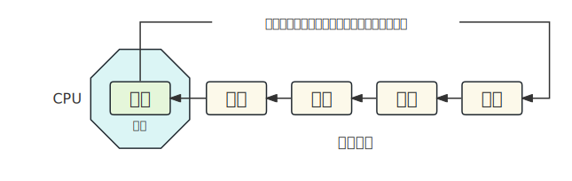
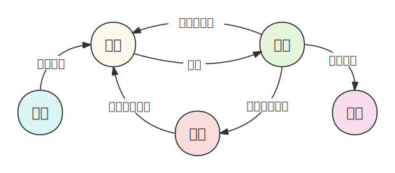
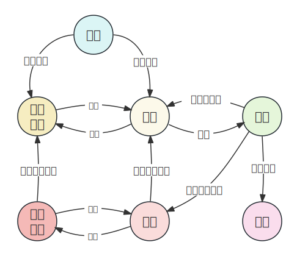

## 1. 进程的调度

### 时间片

一个操作系统中运行的进程数量远大于CPU核心的数量，为了并发（Concurrency）执行多个进程，操作系统需要将CPU资源轮流分配给进程使用。

CPU调度进程的模型可简化为下图。

操作系统会为就绪的进程维护一个任务队列，队列中的进程将轮流使用CPU资源，每个进程每次只能在CPU上运行一小段时间。为了公平地分配处理器时间，并确保每个任务都有机会执行，操作系统使用调度算法将处理器时间划分为固定长度的**时间片**。

通过使用时间片，操作系统可以实现多任务并发执行。每个任务在自己的时间片内运行，当时间片用完时，系统会重新调度其他任务继续执行。这种轮转的调度方式确保了任务的公平性，并避免了某个任务长时间独占处理器资源，导致其他任务无法得到执行的情况。

### 上下文切换

由于进程是轮流被调度的，所以操作系统必须知道从哪里加载任务，以及从哪里开始运行。当进程在CPU上运行时，这些信息保存在CPU的一组寄存器中，比如其中的程序计数器（Program Counter，PC）这个寄存器用于保存将执行的下一条指令的地址。这些信息称为**CPU上下文**。

::: info 上下文切换

上下文切换是指 **操作系统保存当前任务的上下文，并加载下一个任务的上下文** 的过程。上下文包括了任务的寄存器状态、程序计数器、内存映射、打开文件等与任务执行相关的信息。通过上下文切换，操作系统可以暂停当前任务的执行，并切换到其他任务继续执行。

:::

## 2. 进程的状态

一个进程可以有很多不同的状态，下面是Linux内核源代码中定义的进程状态。

~~~c
/*
 * The task state array is a strange "bitmap" of
 * reasons to sleep. Thus "running" is zero, and
 * you can test for combinations of others with
 * simple bit tests.
 */
static const char * const task_state_array[] = {
    /* states in TASK_REPORT: */
    "R (running)",        /* 0x00 */
    "S (sleeping)",        /* 0x01 */
    "D (disk sleep)",    /* 0x02 */
    "T (stopped)",        /* 0x04 */
    "t (tracing stop)",    /* 0x08 */
    "X (dead)",        /* 0x10 */
    "Z (zombie)",        /* 0x20 */
    "P (parked)",        /* 0x40 */
    /* states beyond TASK_REPORT: */
    "I (idle)",        /* 0x80 */
};
~~~

使用命令 `ps a` 可以查看进程的状态，`STAT` 列显示了各进程当前的状态。

### 运行（R）

只要进程正在被CPU执行，或者在运行队列中等待CPU资源即将被执行，那么它的状态就是 `R`，可以写一个简单的死循环代码来观察。

~~~c
int main() {
    while (1);
}
~~~

::: tip 代码编译运行说明

为了方便表示，下文中的代码都命名 `main.c`，用 `gcc` 进行编译，编译的可执行文件为 `main`。

~~~bash
gcc -o main main.c
~~~

由于程序在前台运行，为了观察，需要在机器上另外新建一个终端。

:::

将程序运行起来后，在其他终端下检查进程，可以发现它的运行状态是 `R`。（状态后面的 `+` 表示这是一个前台进程，如果让程序以后台运行的方式执行，那么运行状态会显示为 `R`，我们之后不再关注这个 `+`）。

~~~bash
akashi@box:~$ ps a | head -1 && ps a | grep main
  PID TTY      STAT   TIME COMMAND
14617 pts/6    R+     0:10 ./main
~~~

由于 `R` 状态的进程正在被CPU执行，如果你的机器上安装了 `htop`，可以使用该命令直观的查看的CPU使用率。当上面的死循环运行时，你会发现CPU（如果你的CPU是多核的，那么这里指的是其中一个CPU核心）是满载的。

### 睡眠（S）

虽然名为 `sleeping`，但是此时进程是在等待某种资源或者等待事件完成。比如I/O事件，我们可以写一个最简单的I/O程序观察进程状态。

~~~c
#include <stdio.h>

int main() {
    char buf[32];
    scanf("%s",buf);
    printf("%s\n", buf);
    return 0;
}
~~~

程序运行后，我们先不输入数据。在一个新的终端下观察进程。

~~~bash
akashi@box:~$ ps a | head -1 && ps a | grep main
  PID TTY      STAT   TIME COMMAND
16242 pts/7    S+     0:00 ./main
~~~

可以发现进程当前的状态为 `S`，这里进程是在等待I/O资源，即用户输入事件。有许多情况可以让进程进入 `S` 状态，下面是一些场景的情况。

::: info 睡眠状态的进程

1. **等待I/O操作完成**：当进程执行某个需要等待I/O操作完成的指令时，例如读取磁盘上的数据或等待网络数据的到达，它会进入睡眠状态，直到相应的I/O操作完成。
2. **等待信号**：进程可以通过等待信号的到来来实现同步或异步通信。当进程调用了等待信号的系统调用（如 `sigwait()`、`sigsuspend()` ）时，它会进入睡眠状态，直到相应的信号到达。
3. **等待资源**：进程可能会因为等待某个资源而进入睡眠状态。例如，当进程需要访问一段被其他进程锁定的共享内存或互斥锁时，它会进入睡眠状态，直到资源可用。
4. **等待子进程退出**：当父进程调用了wait()或waitpid()等系统调用来等待子进程退出时，父进程会进入睡眠状态，直到子进程退出。
5. **调度等待**：当进程使用了所有可用的CPU时间片后，它可能会进入睡眠状态，等待调度器重新分配CPU时间片。

:::

### 磁盘睡眠（D）

也叫 **不可中断睡眠**。当进程处于 `D` 状态时，它正在等待一个不可中断的事件完成，例如等待磁盘I/O操作完成或等待某个硬件设备的响应。

`D` 状态是一种特殊的睡眠状态，与普通的睡眠状态不同。在 `D` 状态下，进程无法被中断或唤醒，除非等待的事件满足或异常发生。这意味着 `D` 状态的进程无法响应中断信号或其他通常用于唤醒进程的事件。

在Linux系统中，通常无法直接模拟出一个处于 `D` 状态的进程，因为这种状态通常是由内核在等待某个不可中断的事件时设置的。一般用户空间的应用程序无法直接进入到D状态。只有内核模块或驱动程序在特定条件下才能进入该状态。

### 停止（T）

`T` 状态表示进程已经被停止或暂停，它不会执行任何指令，也不会消耗CPU时间片。通常，`T` 状态的进程是由于接收到了一个停止信号（`SIGSTOP`）而被暂停的。

对一个进程使用 `kill` 命令发送 `SIGSTOP` 信号，可以使其暂停进入 `T` 状态。对 `T` 状态的进程发送 `SIGCONT` 信号，可以使其恢复运行。

为了方便观察，我们使用以下的代码，让进程循环打印 `Hello, world`，然后对进程发送 `SIGSTOP` 信号，观察现象。

~~~c
#include <stdio.h>
#include <unistd.h>

int main() {
    while (1) {
        printf("Hello, world\n");
        sleep(1);
    }
    return 0;
}
~~~

程序被执行后，每隔一秒向屏幕打印一次。分别查看发送信号前后的进程的状态。

~~~bash
akashi@box:~$ ps a | head -1 && ps a | grep main
  PID TTY      STAT   TIME COMMAND
16242 pts/7    S+     0:00 ./main

akashi@box:~$ kill -SIGSTOP 16242

akashi@box:~$ ps a | head -1 && ps a | grep main
  PID TTY      STAT   TIME COMMAND
16242 pts/7    T+     0:00 ./main
~~~

可以发现，发送了 `SIGSTOP` 信号后，进程进入了 `T` 状态，同时进程停止了屏幕打印。如果想让其恢复运行，可以继续向进程发送 `SIGCONT` 信号。

~~~bash
akashi@box:~$ ps a | head -1 && ps a | grep main
  PID TTY      STAT   TIME COMMAND
16242 pts/7    T+     0:00 ./main

akashi@box:~$ kill -SIGCONY 16242

akashi@box:~$ ps a | head -1 && ps a | grep main
  PID TTY      STAT   TIME COMMAND
16242 pts/7    S+     0:00 ./main
~~~

之后可以观察到进程恢复了运行，继续向屏幕上打印 `Hello, world`。

::: info 无法停止进程的问题

如果前台无法停止该进程，可以发送 `SIGKILL` 信号杀死该进程。关于信号的问题，不在本文讨论范围之内。

~~~bash
kill -SIGKILL <进程的PID>
~~~

:::

### 死亡（X）

死亡 `X` 状态不是Linux中标准的进程状态，它是内核源代码中特定系统的定义。它只是进程终止时的一个返回状态，通常无法被观察到。

### 僵尸（Z）

当一个进程终止时，内核会保留一些信息，包括进程的退出状态和一些元数据，以供父进程查询。这样的终止进程称为僵尸进程（Zombie Process），即处于 `Z` 状态。由于僵尸进程已经终止，所以它不会消耗任何CPU资源，处于一个等待回收的状态，但是它会占用一定的内存空间，所以父进程必须进行回收（调用 `wait()`、`waitpid()` 接口），大量的僵尸进程会影响系统的稳定运行。

当子进程退出时，如果父进程没有回收子进程的资源，那么子进程会处于僵尸状态。我们可以用下面的代码进行验证，用 `fork()` 创建一个子进程，随后子进程立即退出，父进程不对子进程的资源进行释放。

~~~c
#include <stdio.h>
#include <unistd.h>

int main() {
    if (fork())
        getchar(); // 父进程
    else
        return 1;  // 子进程
    return 0;
}
~~~

运行程序，使用命令 `ps ajx` 查看两个进程的状态。

~~~bash
akashi@box:~$ ps ajx | head -1 && ps ajx | grep main
 PPID     PID    PGID     SID TTY        TPGID STAT   UID   TIME COMMAND
15610   20030   20030   15610 pts/7      20030 S+    1000   0:00 ./main
20030   20031   20030   15610 pts/7      20030 Z+    1000   0:00 [main] <defunct>
~~~

可以看到 `PID` 分别为 `20030` 和 `20031` 的父进程和子进程。子进程的状态为 `Z`。

## 3. 进程状态的转换

### 三态模型

进程的三态模型是指进程在操作系统中的三种基本状态：**运行态**（Running）、**就绪态**（Ready）和**阻塞态**（Blocked）。

::: info 三态模型

**1. 运行态（Running）**：进程当前正在被CPU执行指令，处于活动状态。进程在运行态下使用CPU资源执行其指令流，并在时间片用完或者主动放弃CPU时可能会转换到其他状态。

**2. 就绪态（Ready）**：进程已经满足了执行的前提条件，但由于CPU资源有限，它还未被分配到CPU上执行。进程在就绪态下等待调度器将其选中并分配CPU资源，以便进入运行态执行。

**3. 阻塞态（Blocked）**：进程由于某些原因无法继续执行，需要等待某个事件的发生，例如等待I/O操作完成或等待某个资源的释放。在阻塞态下，进程被置于等待队列中，直到所需的事件发生，然后可能转换到就绪态或运行态。

- 就绪 ⇨ 运行：当调度器从就绪队列中选择一个进程，并将CPU资源分配给它时，进程从就绪态转换到运行态。
- 运行 ⇨ 就绪：当进程的时间片用完、主动放弃CPU资源或被更高优先级的进程抢占时，进程从运行态转换到就绪态。
- 运行 ⇨ 阻塞：当进程需要等待某个事件发生时，例如等待I/O操作完成，它会从运行态转换到阻塞态，并将CPU资源释放给其他进程。
- 阻塞 ⇨ 就绪：当被等待的事件发生后，进程从阻塞态转换到就绪态，重新加入就绪队列，等待调度器将其选中并分配CPU资源。

:::

当我们在Linux操作系统上查询到进程的状态为 `R` 时，说明该进程处于就绪态或者运行态。而查询状态为 `S` 时，则处于阻塞态。

### 五态模型

五态模型在三态模型的基础上增加了**新建态**（New）和**终止态**（Terminated）。

::: info 五态模型

在三态模型的基础上，新增了两个状态：

**4. 创建态（New）**：进程正在被创建，但尚未完全准备好运行。在创建态下，操作系统正在为进程分配必要的资源和数据结构。一旦创建完成，进程将转换到就绪态等待被调度。

**5. 终止态（Terminated）**：进程已经完成了它的执行，或者由于某些原因被操作系统终止。在终止态下，进程释放占用的资源，并等待操作系统回收其相关的数据结构。

- 创建 ⇨ 就绪：当进程被创建并准备好运行时，它从创建态转换到就绪态，等待调度器将其选中并分配CPU资源。
- 运行 ⇨ 终止：当进程完成了它的执行或者被操作系统终止时，进程从运行态转换到终止态，释放占用的资源。

:::

### 七态模型

七态模型在五态模型的基础上还引入了两个额外的状态**挂起就绪态**（Suspended Ready）和**挂起阻塞态**（Suspended Blocked）。

在之前Linux进程状态的例子中，使用 `kill -SIGSTOP` 命令向进程发送信号使其转换为 `T` 状态使其暂停，就属于挂起就绪态的一种。

::: info 七态模型

在五态模型的基础上，新增了两个状态：

**6. 挂起就绪态（Suspended Ready）**：进程被挂起，暂时不参与调度和执行，但已准备好运行。

**7. 挂起阻塞态（Suspended Blocked）**：进程被挂起，暂时不参与调度和执行，且处于阻塞状态。

在某些情况下，操作系统的负载管理机制可能会挂起一些进程，以便在系统资源紧张时为其他重要任务腾出空间。

:::

在Linux中，当系统内存资源不足时，操作系统可以使用 `Swap` 来将部分内存中的进程数据写入到硬盘上的Swap分区或Swap文件中。这样可以释放内存空间，为其他进程提供更多的可用内存。

当一个进程被挂起时，可能会将其相关的数据写入到 `Swap` 中，以释放内存。这样进程的状态可以转换为挂起就绪态（Suspended Ready）或挂起阻塞态（Suspended Blocked）。在这种状态下，进程不占用实际的内存资源，而是保存在Swap中，以便在需要时进行恢复。

当操作系统决定重新调度挂起的进程时，它从Swap中读取进程的数据，将其恢复到内存中，并将其状态转换为就绪态（Ready）或阻塞态（Blocked），具体取决于进程在挂起之前的状态。

## 4. 进程的优先级

进程的优先级指的是，操作系统调度进程时，给予每个进程的优先顺序。优先级较高的进程在竞争有限系统资源时，更有可能被调度执行。

在Linux系统中，进程的优先级是通过Nice值来表示的。Nice值是一个整数，范围通常是从-20到+19，其中-20表示最高优先级，+19表示最低优先级。

Nice值越低，进程的优先级越高。通常，普通用户的进程的Nice值范围是0到+19，而具有超级用户权限（root）的进程可以使用负值，即-20到-1。

编译运行下面的代码，使用 `ps -al` 命令查看进程的优先级。

~~~c
#include <stdio.h>
#include <unistd.h>

int main() {
    while (1) {
        printf("hello\n");
        sleep(1);
    }
    return 0;
}
~~~

~~~bash
akashi@box:~$ ps -al
F S   UID     PID    PPID  C PRI  NI ADDR SZ WCHAN  TTY          TIME CMD
0 S  1000    6823    6218  0  80   0 -   664 hrtime pts/4    00:00:00 main
~~~

命令输出了程序的 `PRI` 和 `NI` 值，`PRI`（priority）表示的是程序的优先级，`NI`（nice）是优先级的修改数值（偏移量），`PRI` 的默认值为80。`PRI` 的值越小，表示优先级越高。

可以使用 `renice` 命令修改进程的优先级。

~~~bash
akashi@box:~$ renice 10 -p 6823
6823 (process ID) 旧优先级为 0，新优先级为 10

akashi@box:~$ ps -al
F S   UID     PID    PPID  C PRI  NI ADDR SZ WCHAN  TTY          TIME CMD
0 S  1000    6823    6218  0  90  10 -   664 hrtime pts/4    00:00:00 main
~~~

将 `NI` 值从0改成10，那么 `PRI` 会变为 80 + 10 = 90。

如果要将 `NI` 改为负值，则需要 `root` 权限。

~~~bash
akashi@box:~$ renice -10 -p 6823 # 直接设置
renice: 设置 6823 的优先级失败(process ID): 权限不够

akashi@box:~$ sudo renice -10 -p 6823 # 使用root权限
6823 (process ID) 旧优先级为 10，新优先级为 -10

akashi@box:~$ ps -al
F S   UID     PID    PPID  C PRI  NI ADDR SZ WCHAN  TTY          TIME CMD
0 S  1000    6823    6218  0  70 -10 -   664 hrtime pts/4    00:00:00 main
~~~

将 `NI` 值从0改成-10，那么 `PRI` 会变为 80 + (-10) = 70。

`NI` 的取值范围是-20到19，不能超出这个范围。

~~~bash
akashi@box:~$ sudo renice -20 -p 6823
6823 (process ID) 旧优先级为 -10，新优先级为 -20

akashi@box:~$ sudo renice -21 -p 6823 # 无法设为小于-20的值
6823 (process ID) 旧优先级为 -20，新优先级为 -20

akashi@box:~$ renice 19 -p 6823
6823 (process ID) 旧优先级为 -20，新优先级为 19

akashi@box:~$ renice 20 -p 6823 # 无法设为大于19的值
6823 (process ID) 旧优先级为 19，新优先级为 19
~~~
